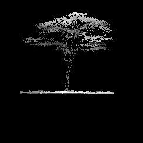

# PCTreeS — 3D Point Cloud Tree Species Classification Using Airborne LiDAR Images

Mapping tree species in Mpala with airborne LiDAR images for CS 288 Class Project 2022 Fall




## About
### Abstract/Project Goal
Reliable large-scale data on the state of forests is crucial for monitoring ecosystem health, carbon stock, and the impact of climate change. Current knowledge of tree species distribution relies heavily on manual data collection in the field, which often takes years to complete, resulting in limited datasets that cover only a small subset of the world’s forests. Recent works show that state-of-the-art deep learning models using Light Detection and Ranging (LiDAR) images enable accurate and scalable classification of tree species in various ecosystems. While LiDAR images contain rich 3-Dimensional (3D) information, most previous works flatten the 3D images into 2D projections in order to use Convolutional Neural Networks (CNNs). This paper offers three significant contributions: 1) we apply the deep learning framework for tree classification in tropical savannas; 2) we use Airborne LiDAR images, which have a lower resolution but greater scalability than Terrestrial LiDAR images used in most previous works; 3) we introduce the approach of directly feeding 3D point cloud images into a vision transformer model (PCTreeS). Our results show that the PCTreeS approach outperforms current CNN baselines with 2D projections in AUC (0.81), overall accuracy (0.72), and training time ($sim$ 45 mins). This paper also motivates further LiDAR image collection and validation for accurate large-scale automatic classification of tree species.

### Models
Simple View
PCT
PCTreeS

### Misc
GIFs and dataset code

## Installation
1. Clone repo: `gh repo clone nicole-hjlin/mpala-tree-mapping`
2. Install requirements: `pip install -r requirements.txt`
3. Git submodule sync
4. Install PCT
5. Run model:
```
$ python main.py --help
usage: main.py [-h] [--name NAME] [--learning_rate LEARNING_RATE] [--momentum MOMENTUM] [--epochs EPOCHS] [--batch_size BATCH_SIZE] [--spicy] [--normalize]
               [--min_points MIN_POINTS] [--train_split TRAIN_SPLIT] [--data_dir DATA_DIR] [--label_path LABEL_PATH] [--top_species TOP_SPECIES]
               [--use_baseline USE_BASELINE]

options:
  -h, --help            show this help message and exit
  --name NAME           Name of experiment
  --learning_rate LEARNING_RATE
                        SGD learning rate
  --momentum MOMENTUM   SGD momentum
  --epochs EPOCHS       Number of epcohs
  --batch_size BATCH_SIZE
                        Mini batch size
  --spicy               Treat projections as channels of a single datapoint
  --normalize           Equally normalize projections across dataset
  --min_points MIN_POINTS
                        Minimum number of points
  --train_split TRAIN_SPLIT
                        Fraction of data to keep as train split
  --data_dir DATA_DIR   Path to LiDAR data directory
  --label_path LABEL_PATH
                        Path to labels
  --top_species TOP_SPECIES
                        Number of species to classify. The most frequent species are selected and the rest are considered OTHER
  --use_baseline USE_BASELINE
                        Use the baseline model
```

## Authors

Hongjin Lin, Matthew Nazari, Derek Zheng

Harvard University